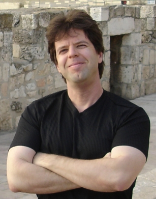
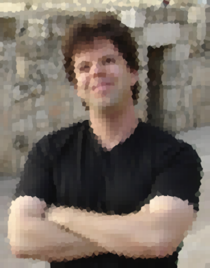
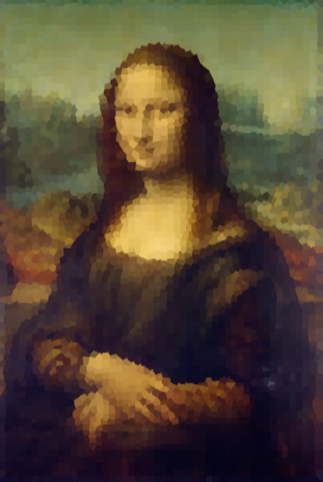
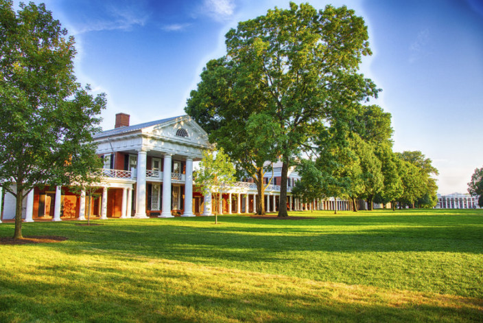
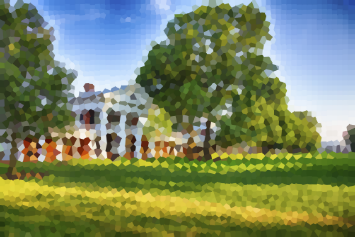
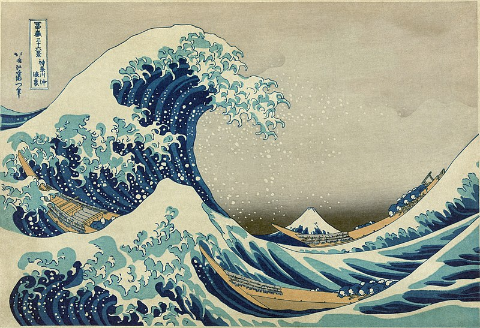

# Voronoi-Art
Converts a given colored image to a voronoi diagram

## Solution Process
The solution process works in two steps. They are described here.

1. **Choosing Site points and their colors** To make the generated voronoi diagram as close as to the original image, we need to choose the position of the site points and also assign a color to the corresponding cell of that site point. Choosing the site point positions naively can result in a bad voronoi tesselation as it can distort the edges in the image. The general idea is, we want to use a cell for a group of pixels that are in proximity and have similar colors. This grouping of pixels is a common task in image processing, called Image Segmentation. In our solution, we have used K-Means Clustering for this purpose. The cluster centroids are used as the site points. This process gives us good site positions to use for the voronoi tesselation step. We assign the mean RGB value of a cluster to its centroid, i.e all pixels that are in the voronoi cell of a site point will be assigned this mean color.

2. **Voronoi Implementation** After getting the cluster centroids, which will be now the site points of our voronoi region, we use a CPP snippet `voronoi.cpp` to generate the voronoi polygons. This step can also be done by using voronoi libraries (example available in `voronoi_art.py`)

## Instructions to Run
1. Install the required python packages `pip install -r requirements.txt`
2. To run the Python Implementation: `python voronoi_art.py <image file> <# of site points>`
3. For the Python + cpp Implementation: `bash voronoi_art.sh <image file> <# of site points>`

## Sample Input-Output
 
 
 
 
